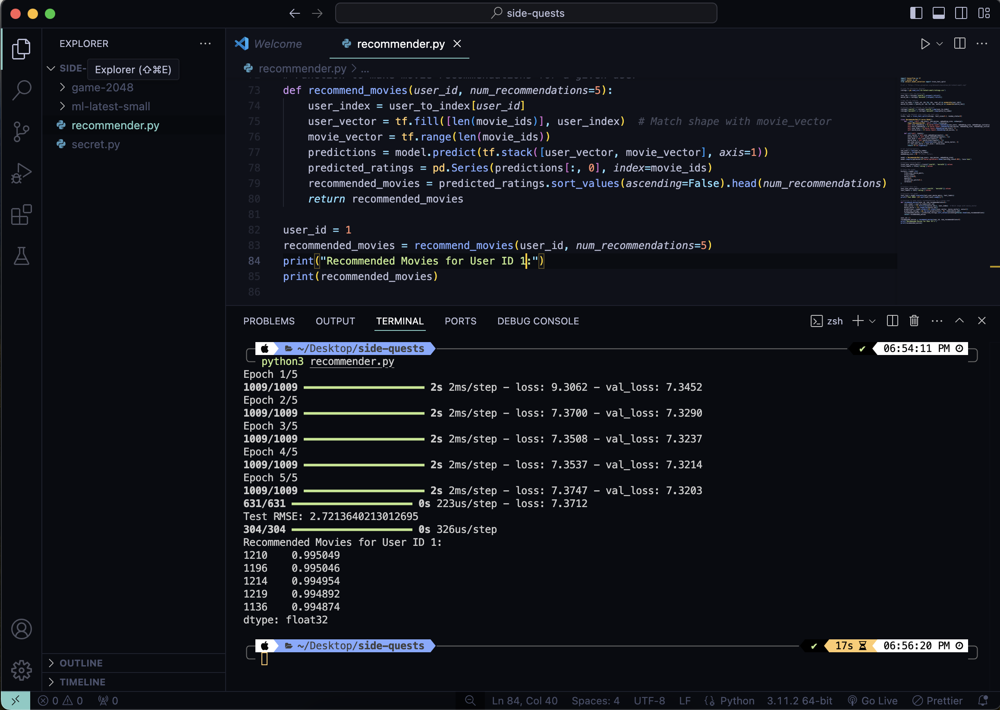
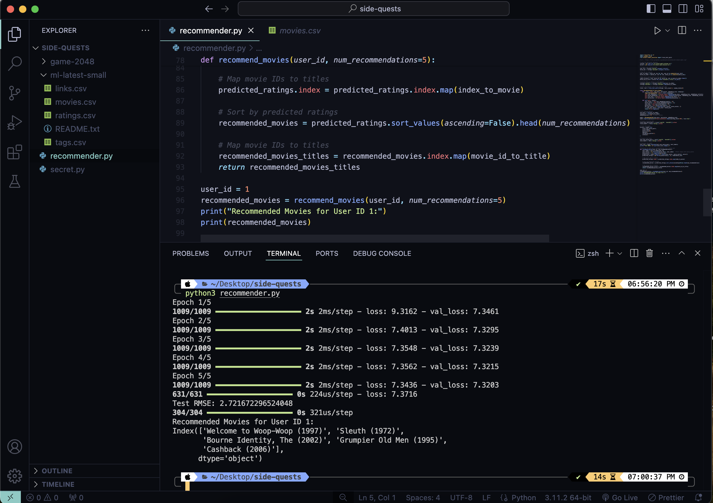

# Practice using TensorFlow

For one of my classes we were learning the basics of machine learning. Although I understood the basics, the formulas and the math, I wanted to try making a project that would help me understand the practical.

I chose recommender to practice as I hope to build a web app like Netflix for practice sometime by the end of this year. So this seemed perfect to test my understanding.

NOTE! Not my data! Data used from MovieLens, url = "https://files.grouplens.org/datasets/movielens/ml-latest-small.zip"

## Screenshots:

1. First I just had the movie ID and the prediction
   

2. Later I changed it to just show the names of the movies
   

## Thought process:

I had to first read up on these two points to refresh my understanding.

1. Recommendation Algorithms:

Collaborative Filtering: Makes recommendations based on user behavior, such as ratings or purchases.
Content-Based Filtering: Recommends items similar to those the user liked in the past.

2. Matrix Factorization:

A common method in recommendation systems where you decompose a large matrix (like user-item ratings) into smaller matrices to discover hidden patterns.

### Data set

I googled and found the dataset from MovieLens to be clear and enough for a beginner.
The MovieLens dataset contains user ratings for movies and movie details. It’s used to train the recommendation model. It uses a unique ID for each movie. So to prepare the data I had to convert these IDs into numerical indices so the model can work with them more easily.

### Embeddings

This was the topic I spent most time reading up on. In class we understood the theory and the formula for the sigmoid and ReLU functions but I was unsure how it actually happened.
Turns out its just a few lines of code:

- class RecommenderNet: Defined a custom TensorFlow model for recommendation.
- the init function : Initialized the model with user and movie embeddings, and biases for users and movies.
- call function : Defined the forward pass of the model, where embeddings are used to compute a score (dot product) for user-movie pairs, adjusted with biases, and passed through a sigmoid function to get predictions.

Once I did that, I defined quickly the loss function and optimiser. Then I googled and watched videos on how the training actually works. It's amazing how it's just a few lines of code and TensorFlow takes care of the rest. I guess not much we can do while the machine learns.
